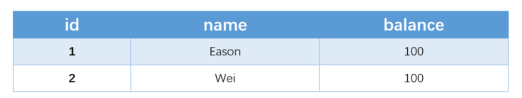

## 一、锁的介绍

### （1）梗概

1. 加锁机制

   1. 乐观锁
   2. 悲观锁

2. 锁粒度

   1. 表锁
   2. 页锁
   3. 行锁

3. 兼容性

   1. 共享锁
   2. 排他锁

4. 锁模式

   1. 记录锁（Record Locks，关键字：lock_mode X locks rec but not gap）
   2. 间隙锁（Gap Locks，关键字：gap before rec）
   3. 临键锁（Next-Key Locks）
   4. 意向锁（Intention）
   5. 插入意向锁（Insert Intention）

   


### （2）共享锁与排他锁

InnoDB 实现了标准的行级锁，包括两种：共享锁（简称 s 锁）、排它锁（简称 x 锁）。

- 共享锁（S锁）：允许持锁事务读取一行。
- 排他锁（X锁）：允许持锁事务更新或者删除一行。

如果事务 T1 持有行 r 的 s 锁，那么另一个事务 T2 请求 r 的锁时，会做如下处理：

- T2 请求 s 锁立即被允许，结果 T1 T2 都持有 r 行的 s 锁
- T2 请求 x 锁不能被立即允许

如果 T1 持有 r 的 x 锁，那么 T2 请求 r 的 x、s 锁都不能被立即允许，T2 必须等待T1释放 x 锁才可以，因为X锁与任何的锁都不兼容。


这两种是锁的模式可以和行锁、间隙锁混搭，**多个事务可以同时持有S锁，但是只有一个事务能持有X锁**

### （3）记录锁（Record Locks）

关键字：lock_mode X locks rec but not gap

- 记录锁是最简单的行锁，**仅仅锁住一行**。如：`SELECT c1 FROM t WHERE c1 = 10 FOR UPDATE`
- 记录锁**永远都是加在索引上**的，即使一个表没有索引，InnoDB也会隐式的创建一个索引，并使用这个索引实施记录锁。
- 会阻塞其他事务对其插入、更新、删除

### （4）间隙锁（Gap Locks）

关键字：gap before rec

**在RR隔离级别下，为了防止幻读现象，除了给记录本身，还需要为记录两边的间隙加上间隙锁。**

- 间隙锁是一种加在两个索引之间的锁，或者加在第一个索引之前，或最后一个索引之后的间隙。
- 使用间隙锁锁住的是一个区间，而不仅仅是这个区间中的每一条数据。
- 间隙锁相互兼容，间隙锁只阻止其他事务插入到间隙中，他们不阻止其他事务在同一个间隙上获得间隙锁，所以 gap x lock 和 gap s lock 有相同的作用。比如列a上有一个普通索引，已经有了1、5、10三条记录，`select * from t where a=5 for update`除了会给5这条记录加行锁，还会给间隙(1,5)和(5,10)加上间隙锁，防止其他事务插入值为5的数据造成幻读。

### （5）临键锁（Next-Key Locks）

- Next-key锁是记录锁和间隙锁的组合，它指的是加在某条记录以及这条记录前面间隙上的锁。

### （6）意向锁（Intention）

- 意向共享锁( IS 锁)：事务想要获得一张表中某几行的共享锁
- 意向排他锁( IX 锁)： 事务想要获得一张表中某几行的排他锁

比如：事务1在表1上加了S锁后，事务2想要更改某行记录，需要添加IX锁，由于不兼容，所以需要等待S锁释放；如果事务1在表1上加了IS锁，事务2添加的IX锁与IS锁兼容，就可以操作，这就实现了更细粒度的加锁。

InnoDB存储引擎中锁的兼容性如下表：


### （7）插入意向锁（Insert Intention）

- 插入意向锁是在插入一行记录操作之前设置的一种间隙锁，这个锁释放了一种插入方式的信号，亦即多个事务在相同的索引间隙插入时如果不是插入间隙中相同的位置就不需要互相等待。
- 插入意向锁和间隙锁互斥，比如事务1锁了(1,5)这个间隙，事务2就不能获取到a=3的插入意向锁，所以需要锁等待。
- 假设有索引值4、7，两个不同的事务准备插入5、6，每个锁都在获得插入行的独占锁之前用插入意向锁各自锁住了4、7之间的间隙，但是不阻塞对方因为插入行不冲突。

### （8）锁兼容矩阵

​	横向是已持有锁，纵向是正在请求的锁


---

## 二、死锁分析

### （1）模拟死锁


表结构:

```pgsql
//id是自增主键，name是非唯一索引，balance普通字段
CREATE TABLE `account` (
  `id` int(11) NOT NULL AUTO_INCREMENT,
  `name` varchar(255) DEFAULT NULL,
  `balance` int(11) DEFAULT NULL,
  PRIMARY KEY (`id`),
  KEY `idx_name` (`name`) USING BTREE
) ENGINE=InnoDB AUTO_INCREMENT=3 DEFAULT CHARSET=utf8;
```


表中的数据：




模拟并发


1）事务A执行更新操作，更新成功

```pgsql
mysql> update  account  set balance =1000 where name ='Wei';
Query OK, 1 row affected (0.01 sec)
```

2）事务B执行更新操作，更新成功

```pgsql
mysql> update  account  set balance =1000 where name ='Eason';
Query OK, 1 row affected (0.01 sec)
```

3）事务A执行插入操作，陷入阻塞~

```n1ql
mysql> insert into account values(null,'Jay',100);
```


### （2）死锁分析

#### 事务A中update语句的加锁情况

```pgsql
update  account  set balance =1000 where name ='Wei';
```

**间隙锁：**

- Update语句会在非唯一索引的name加上左区间的间隙锁，右区间的间隙锁(因为目前表中只有name='Wei'的一条记录，所以没有中间的间隙锁~)，即（E,W) 和（W，+∞）
- 为什么存在间隙锁？因为这是RR的数据库隔离级别，用来解决幻读问题用的~

**记录锁**

- 因为name是索引，所以该update语句肯定会加上W的记录锁

**Next-Key锁**

- Next-Key锁=记录锁+间隙锁，所以该update语句就有了（E，W]的 Next-Key锁

**综上所述，事务A执行完update更新语句，会持有锁：**

- Next-key Lock：（E，W]
- Gap Lock ：（W，+∞）

#### 事务A中insert语句的加锁情况

```n1ql
insert into account values(null,'Jay',100);
```

**间隙锁：**

- 因为Jay(J在E和W之间)，所以需要请求加(E,W)的间隙锁

**插入意向锁（Insert Intention）**

- 插入意向锁是在插入一行记录操作之前设置的一种间隙锁，这个锁释放了一种插入方式的信号，即事务A需要插入意向锁(E,W)

**因此**，事务A的update语句和insert语句执行完，它是持有了 **（E，W]的 Next-Key锁**，**（W，+∞）的Gap锁**，想拿到 **(E,W)的插入意向排它锁**，等待的锁跟死锁日志是对上的


#### 事务B中update语句的加锁情况

```pgsql
update  account  set balance =1000 where name ='Eason';
```

**间隙锁：**

- Update语句会在非唯一索引的name加上左区间的间隙锁，右区间的间隙锁(因为目前表中只有name='Eason'的一条记录，所以没有中间的间隙锁~)，即（-∞，E）和（E，W）

**记录锁**

- 因为name是索引，所以该update语句肯定会加上E的记录锁

**Next-Key锁**

- Next-Key锁=记录锁+间隙锁，所以该Update语句就有了（-∞，E]的 Next-Key锁

**综上所述，事务B执行完update更新语句，会持有锁：**

- Next-key Lock：（-∞，E]
- Gap Lock ：（E，W）

#### 事务B中insert语句的加锁情况

```n1ql
insert into account  values(null,'Yan',100);
```

**间隙锁：**

- 因为Yan(Y在W之后)，所以需要请求加(W,+∞)的间隙锁

**插入意向锁（Insert Intention）**

- 插入意向锁是在插入一行记录操作之前设置的一种间隙锁，这个锁释放了一种插入方式的信号，即事务A需要插入意向锁(W,+∞)

**所以**，事务B的update语句和insert语句执行完，它是持有了 **（-∞，E]的 Next-Key锁**，**（E，W）的Gap锁**，想拿到 **(W,+∞)的间隙锁，即插入意向排它锁**，加锁情况跟死锁日志也是对上的~


### （3）死锁真相还原

接下来呢，让我们一起还原死锁真相吧


- 事务A执行完Update Wei的语句，持有（E，W]的Next-key Lock，（W，+∞）的Gap Lock ，插入成功~
- 事务B执行完Update Eason语句，持有（-∞，E]的 Next-Key Lock，（E，W）的Gap Lock，插入成功~
- 事务A执行Insert Jay的语句时，因为需要（E，W）的插入意向锁，但是（E，W）在事务B怀里，所以它陷入心塞~
- 事务B执行Insert Yan的语句时，因为需要(W,+∞) 的插入意向锁，但是(W,+∞) 在事务A怀里，所以它也陷入心塞。
- 事务A持有（W，+∞）的Gap Lock，在等待（E，W）的插入意向锁，事务B持有（E，W）的Gap锁，在等待(W,+∞) 的插入意向锁，所以形成了死锁的闭环~（Gap锁与插入意向锁会冲突的，可以看回锁介绍的锁模式兼容矩阵哈~）
- 事务A,B形成了死锁闭环后，因为Innodb的底层机制，它会让其中一个事务让出资源，另外的事务执行成功，这就是为什么你最后看到事务B插入成功了，但是事务A的插入显示了Deadlock found


## 三、总结


### （1）死锁分析过程

1. show engine innodb status;查看死锁日志
2. 熟悉锁模式兼容矩阵，InnoDB存储引擎中锁的兼容性矩阵。
3. 查看死锁日志中，每一个事务的`HOLDS THE LOCK`和`WAITING FOR THIS LOCK TO BE GRANTED`，查看他们持有和等待的锁
4. 根据锁兼容矩阵和sql语句进行定位和分析

### （2）如何尽可能避免死锁

1. 合理的设计索引，区分度高的列放到组合索引前面，使业务 SQL 尽可能通过索引`定位更少的行，减少锁竞争`。
2. 调整业务逻辑 SQL 执行顺序， 避免 update/delete 长时间持有锁的 SQL 在事务前面。
3. 避免`大事务`，尽量将大事务拆成多个小事务来处理，小事务发生锁冲突的几率也更小。
4. 以`固定的顺序`访问表和行。比如两个更新数据的事务，事务 A 更新数据的顺序为 1，2;事务 B 更新数据的顺序为 2，1。这样更可能会造成死锁。
5. 在并发比较高的系统中，不要显式加锁，特别是是在事务里显式加锁。如 select … for update 语句，如果是在事务里`（运行了 start transaction 或设置了autocommit 等于0）`,那么就会锁定所查找到的记录。
6. 尽量按`主键/索引`去查找记录，范围查找增加了锁冲突的可能性，也不要利用数据库做一些额外额度计算工作。比如有的程序会用到 “select … where … order by rand();”这样的语句，由于类似这样的语句用不到索引，因此将导致整个表的数据都被锁住。
7. 优化 SQL 和表设计，减少同时占用太多资源的情况。比如说，`减少连接的表`，将复杂 SQL `分解`为多个简单的 SQL。


引自：

- https://segmentfault.com/a/1190000037510033

- https://segmentfault.com/a/1190000019221604?utm_source=sf-similar-article
- https://z.itpub.net/article/detail/7B944ED17C0084CF672A47D6E938B750

